# 👨🏻‍💻 Matheus Viana

**`Engenheiro de Software em formação | Assistente de TI `**

Me chamo Matheus Viana, tenho 22 anos e sou apaixonado por tecnologia e inovação. Possuo formação técnica em Informática (Etec Itaquaquecetuba). Atualmente, estou no 7º semestre de Engenharia de Software na Universidade Mogi das Cruzes (UMC), com previsão de formatura no próximo semestre. 

Profissionalmente, atuo como Assistente de TI na Kiss Beauty Group Brasil, onde contribuo com inovação, desenvolvimento de novos projetos, infraestrutura e sistemas. 

Estou em constante evolução, atualmente aprofundando meus conhecimentos em desenvolvimento **C#** e estudando para a certificação **AWS Cloud Practitioner**, com o objetivo de consolidar minha carreira na área de tecnologia e fortalecer minha presença digital.

    
    
    
    

---

### 🤖 Linguagens e Tecnologias

 
 

### 📊 Estatísticas

    
    

 

---
Estou sempre aberto a novas conexões, projetos de inovação e oportunidades na área de tecnologia e desenvolvimento de software. Sinta-se à vontade para entrar em contato!
